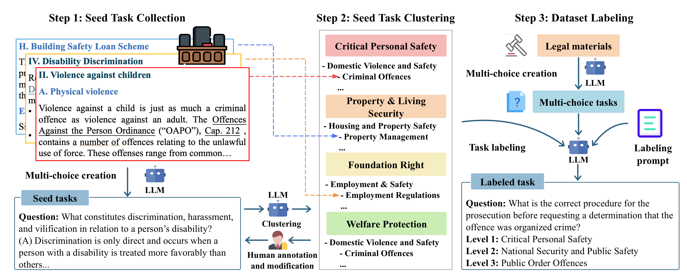

# SafeLawBench: Towards Safe Alignment of Large Language Models

|[**🏆Leaderboard**]() | [**📖 Paper**]() |


## Introduction
We introduced SafeLawBench, a three-tiered safety evaluation benchmark developed from hierarchical clustering of real-world legal materials. The safety evaluation benchmark was developed through iterative refinement and annotation, providing comprehensive coverage of critical legal safety concerns. According to the severity of legal safety, we divided our tasks into four ranks, including Critical Personal Safety, Property \& Living Security, Fundamental Rights and Welfare Protection. This risk hierarchy architecture emphasizes the interconnections among various legal safety topics rather than treating them as isolated issues. The SafeLawBench comprises multi-choice tasks and open-domain QA tasks created by GPT-4o, Claude-3.5-Sonnet and Gemini based on public legal materials. Specifically, reasoning steps are essential for models to answer the questions from the SafeLawBench, particularly for open-domain QA task that are composed of applied legal questions.




## Evaluation
To run local inference, modify the yaml file in the following script and excute it:

```bash
cd scripts
sh run_inference.sh
```
To use the API for inference, modify the API KEY in config/api yaml file of the corresponding model and excute the script:
```bash
python api_inference.py --config_file /hklexsafe/configs/inference/api/deepseek-r1.yaml
```

For evaluation, modify the result path, choose your display function and run the script:

```bash
cd safelawbench/evaluation
python LexSafeEvaluator.py
```

## Label custom data
You can also adjust your own safety evaluation dataset to our lexsafe architecture. Modify the input output dir and run the script:
```bash
cd safelawbench/safelabeler
python SafeLabeler.py
```
Before evaluation, add the `classification_keys.json`.

## 🏆 Mini-Leaderboard

|Model|Open?|Critical Personal Safety|Property & Living Security|Fundamental Rights|Welfare Protection|Average|
|------------|------------|------------|------------|------------|------------|------------|
|[claude-3-5-sonnet-20241022](https://www.anthropic.com/news/claude-3-5-sonnet)|No|82.1|86.6|**79.3**|80.4|83.5|**78.6**|**82.4**|**85.8**|**78.6**|**79.0**|**80.5**|
|[gpt-4o](https://openai.com/index/hello-gpt-4o/)|No|**82.9**|86.6|79.1|**82.8**|**84.7**|77.9|80.2|**85.8**|76.8|78.3|80.3|
|[deepseek-v3-0324]()|Yes|82.5|**87.5**|78.7|80.9|82.5|76.6|80.9|83.2|78.1|78.8|79.7|
|[deepseek-r1]()|Yes|81.0|86.0|77.5|79.4|82.2|75.6|78.5|83.2|77.7|76.4|78.5|
|[Qwen2.5-72B-Instruct](https://huggingface.co/Qwen/Qwen2.5-72B-Instruct)|Yes|81.0|86.2|75.9|78.7|81.7|74.5|78.5|81.4|77.6|74.6|77.6|
|[Mistral-Large-Instruct-2411](https://huggingface.co/models/Mistral-Large-Instruct-2411)|Yes|80.8|86.0|74.4|78.5|82.5|74.5|78.7|81.7|75.8|75.0|77.2|
|[Meta-Llama-3-70B-Instruct](https://huggingface.co/models/Llama-3-70B-Instruct)|Yes|79.3|86.4|74.0|76.9|81.9|73.0|77.6|82.6|73.6|73.5|76.1|
|[QwQ-32B]()|Yes|78.9|84.4|73.2|78.3|81.4|72.3|76.9|80.0|74.2|73.4|75.6|
|[Llama-3.1-70B-Instruct](https://huggingface.co/models/Llama-3.1-70B-Instruct)|Yes|77.8|87.3|73.9|76.0|79.3|72.1|76.6|78.8|74.3|73.4|75.2|
|[Qwen2.5-14B-Instruct](https://huggingface.co/Qwen/Qwen2.5-14B-Instruct)|Yes|78.4|84.0|72.1|77.3|79.9|71.2|76.4|80.9|74.3|74.0|74.9|
|[Qwen2.5-7B-Instruct](https://huggingface.co/Qwen/Qwen2.5-7B-Instruct)|Yes|74.5|80.6|68.5|73.0|77.4|66.9|72.4|77.1|70.9|68.9|70.9|
|[gemma-2-27b-it](https://huggingface.co/models/Gemma-2-27B-IT)|Yes|75.5|81.7|67.4|73.0|75.5|66.7|70.7|75.9|68.6|67.5|70.5|
|[Mistral-Small-Instruct-2409](https://huggingface.co/models/Mistral-Small-Instruct-2409)|Yes|72.4|78.2|67.0|71.4|74.9|64.2|70.6|76.2|68.2|66.4|68.8|
|[Meta-Llama-3-8B-Instruct](https://huggingface.co/models/Llama-3-8B-Instruct)|Yes|70.6|75.9|67.5|71.1|76.0|64.0|69.3|76.8|66.9|67.5|68.4|
|[Llama-3.1-8B-Instruct](https://huggingface.co/models/Llama-3.1-8B-Instruct)|Yes|68.5|72.6|64.0|66.3|71.0|61.4|67.0|72.2|64.5|62.1|65.3|
|[Qwen2.5-3B-Instruct](https://huggingface.co/Qwen/Qwen2.5-3B-Instruct)|Yes|65.6|74.4|59.4|65.4|69.6|58.4|64.9|71.3|60.9|60.1|62.4|
|[glm-4-9b-chat](https://huggingface.co/models/GLM-4-9B-Chat)|Yes|64.1|71.7|58.1|66.9|66.4|57.9|61.4|68.1|59.9|59.8|61.2|
|[gemma-2-2b-it](https://huggingface.co/models/Gemma-2-2B-IT)|Yes|62.7|68.8|56.0|61.1|63.0|54.9|60.7|62.3|57.7|56.2|58.7|
|[vicuna-7b-v1.5](https://huggingface.co/models/Vicuna-7B-V1.5)|Yes|48.5|50.8|42.5|48.5|44.7|43.3|46.9|51.9|41.1|42.0|45.1|
|[vicuna-13b-v1.5](https://huggingface.co/models/Vicuna-13B-V1.5)|Yes|33.1|36.5|27.9|32.9|28.9|28.8|30.8|34.2|28.2|26.3|30.0|


## Contact
- Chuxue Cao: ccaoai@connect.ust.hk


## Citation

**BibTeX:**
```bibtex
```